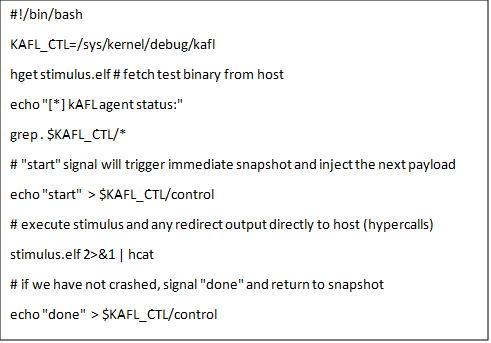

.. _tdx-guest-hardening:

Intel® Trust Domain Extension Guest Linux\* Kernel Hardening Strategy
#####################################################################

Contributors:

Elena Reshetova
Tamas Lengyel
Sebastian Osterlund
Steffen Schulz

1) Purpose of the document and targeted audience
************************************************

The main security goal of Intel® Trust Domain Extension (Intel® TDX)
technology is to remove the need for a guest VM to trust the host and
Virtual Machine Manager (VMM). However, it cannot by itself protect the
guest VM from host/VMM attacks that leverage existing paravirt-based
communication interfaces between the host/VMM and the guest, such as
MMIO, portIO, etc. To achieve protection against such attacks, the guest
VM software stack needs to be hardened to securely handle an untrusted
and potentially malicious input from a host/VMM via the above-mentioned
interfaces. This hardening effort should be applied to a concrete set of
software components that are used within the guest software stack
(virtual BIOS, bootloader, Linux\* kernel and userspace), which is
specific to a concrete deployment scenario. To facilitate this process,
we have developed a hardening methodology and tools that are explained
below.

The hardening approach presented in this document is by no means an
ultimate guarantee of 100% security against the above-mentioned attacks,
but merely a methodology built to our best knowledge and resource
limitations. In our environment, we have successfully applied it to the
Linux TDX MVP software stack (https://github.com/intel/tdx-tools)
to the trust domain (TD) guest Linux kernel and hardened many involved
kernel subsystems. This guide is written with the Linux kernel in mind,
but the outlined principles can be applied to any software component.

The overall threat model and security architecture for the TD guest
kernel is described in the :ref:`security-spec` and it is
recommended to be read together with this document.

2) Hardening strategy overview
******************************

The overall hardening strategy shown in Figure 1 encompasses three
activities that are executed in parallel: attack surface minimization,
manual code audit, and code fuzzing. All of them are strongly linked and
the results from each activity are contributed as inputs to the other
activities. For example, the results of a manual code audit can be used
to decide whenever a certain feature should be disabled (attack surface
minimization) or should be a target for a detailed fuzzing campaign.
Similarly, the fuzzing results might affect the decision to disable a
certain functionality or indicate a place where a manual code audit is
required but have been missed by a static code analyzer.

.. figure:: images/strategy.png
   :width: 5.51418in
   :height: 3.23958in

   Figure 1. Linux Guest kernel hardening strategy.

The following section provides a detailed description of each of these
activities. An overall crucial aspect to consider is the “definition of
done”, i.e., the criteria for when a hardening effort can be finished
and how the success of such effort is defined.

The ideal “definition of done” criteria can be outlined as follows:

1. The guest kernel functionality and the VMM/host exposed interfaces
   are limited to the minimum required for its successful operation,
   given a chosen deployment scenario. This implies that only a minimal
   set of required drivers, kernel subsystems, and individual
   functionality is enabled.

2. All code paths that are enabled within the guest kernel and can take
   an untrusted input from VMM/host must be manually audited from the
   potential consequences of consuming the malformed data. Whenever a
   manual code audit identifies an issue that is a security concern, it
   must be addressed either by a bug fix or by disabling the involved
   code path, if possible.

3. All code paths that are enabled within the guest kernel and can take
   an untrusted input from VMM/host must be fuzzed using an appropriate
   fuzzing technique. The fuzzing technique must provide the coverage
   information to identify that a fuzzer has reached the required code
   paths and exercised them sufficiently. Whenever the fuzzing activity
   identifies an issue that is a security concern, it must be addressed
   either by a bug fix or by disabling the involved code path.

The success of the overall hardening effort is significantly more
difficult to measure. The total number of security concerns identified
by the manual code audit or fuzzing activity is a natural quantifier,
but it neither guarantees that the end goal of having a secure guest
kernel has been successfully reached nor does it necessarily indicate
that the chosen hardening approach is successful. The successful
operation of the guest kernel within the Linux TD software stack and the
absence of issues identified or reported during its deployment lifecycle
is a much stronger, albeit a post factum indicator.

3) Detailed hardening strategy
******************************

3.1) Attack surface minimization
================================

The main objective for this task is to disable as much code as possible
from the TD guest kernel to limit the number of interfaces exposed to
the malicious host/VMM. This is achieved by either explicitly disabling
certain unneeded features (for example early PCI code) , by a generic
filtering approach, such as port IO filtering, driver filtering, etc or
by restricting access to the MMIO and PCI config space regions

Implemented filtering mechanisms
--------------------------------

All the implemented filtering mechanisms described below are runtime
mechanisms that limit TD guest functionality based on a set of default
allow lists defined in the kernel source code, but with a possibility to
override these defaults via a command line option mechanism. The latter
can be used for debugging purposes or for enabling a specific driver,
ACPI table, or KVM CPUID functionality that is required for a particular
deployment scenario.

.. list-table:: Filter status
   :widths: 10 30
   :header-rows: 1

   * - Filter name
     - Purpose and current state
   * - Driver filter
     - Limits a set of drivers that are enabled in runtime for the TD guest kernel.
       By default, all PCI and ACPI bus drivers are blocked unless they are in the allow
       list. The current default allow list for the PCI bus is limited to the
       following virtio drivers: virtio\_net, virtio\_console, virtio\_blk, and
       9pnet\_virtio.
   * - Port IO filter
     - Limits a set of IO ports that can be used for communication between a TD
       guest kernel and the host/VMM. This feature is needed in addition to the
       above driver filtering mechanism, because should some drivers escape this
       mechanism, its port IO communication with the host/VMM will be limited to a
       small set of allowed ports. For example, some linux drivers might perform
       port IO reads in their initialization functions before doing the driver
       registration or some legacy drivers might not utilize the modern driver
       registration interface at all and therefore would be allowed by the above
       driver filter. In any case port IO filter makes sure that only a limited
       number of ports are allowed to be communicating with host/VMM. The port IO
       allow list can be found in section 2.5) IO ports of
       :ref:`security-spec` . Note that in the decompressed mode, the port IO
       filter is not active and therefore it is only applicable for early port IO
       and normal port IO.
   * - ACPI table allow list
     - TDX virtual firmware (TDVF, for details see
       https://www.intel.com/content/dam/develop/external/us/en/documents/tdx-virtual-firmware-design-guide-rev-1.pdf)
       measures a set of ACPI tables obtained from the host/VMM into TDX RTMR[
       0] measurement register. Thus, the set of tables passed by the host/VMM can
       be remotely attested and verified. However, it can be difficult for a
       remote verifier to understand the possible consequences from using a big
       set of various ACPI tables. Since most of the tables are not needed for a
       TDX guest, the implemented ACPI table allow list limits them to a small,
       predefined list with a possibility to pass additional tables via a command
       line option. The current allow list is limited to the following tables:
       XSDT, FACP, DSDT, FACS, APIC, and SVKL. Note that a presence of a minimal
       ACPI table configuration does not by itself guarantee the overall security
       hardening of ACPI subsystem in the TD guest kernel. The known limitations
       on ACPI hardening are described in section 7 of :ref:`security-spec`.
   * - KVM CPUID allow list and KVM hypercalls
     - KVM supports a set of hypercalls that a TD guest kernel can request a VMM to
       perform. On x86, this set is defined by a set of exposed CPUID bits. Some
       of the hypercalls can result in untrusted data being passed from a VMM
       KVM) to the guest kernel. To limit this attack vector, the implemented KVM
       CPUID allow list restricts the available KVM CPUID bits to a small
       predefined allow list. More information can be found in sections 3.6 and
       3.7 of :ref:`security-spec`.

Explicitly disabled functionality
---------------------------------

Most of the functionality described below takes an untrusted host input
via MSR, port IO, MMIO, or pci config space reads through its codebase.
This has been identified using the static code analyzer described in the
next section. The decision to disable this functionality was made based
on the amount of code that would have to be manually audited, complexity
of the code involved, as well as the fact that this functionality is not
needed for the TD guest kernel.

.. list-table:: Features
   :widths: 15 60
   :header-rows: 1

   * - Feature type
     - Description
   * - x86 features
     - Some x86 feature bits are explicitly cleared out by the TD guest kernel
       during an initialization, such as X86\_FEATURE\_MCE, X86\_FEATURE\_MTRR,
       X86\_FEATURE\_TME, X86\_FEATURE\_APERFMPERF, X86\_FEATURE\_CQM\_LLC.
   * - Various PCI functionality
     - Some PCI related functionality that is not needed in the TD guest kernel is
       also explicitly disabled, such as early PCI, PCI quirks, and enhanced PCI
       parsing.
   * - Miscellaneous
     - A malicious host/VMM can fake PCI ids or some CPUID leaves to enable
       functionality that is normally disabled for a TDX guest and therefore not
       hardened. To help prevent this from happening, support for XEN, HyperV, and ACRN
       hypervisors, as well as AMD northbridge support, is explicitly disabled in
       the TD guest kernel.

Opt-in shared MMIO regions & PCI config space access
----------------------------------------------------

To further minimize the amount of code that needs to be hardened, we
require the TD guest kernel to explicitly opt-in any MMIO region that
needs to be shared with the host. This ensures that there is no
accidental shared MMIO regions created in the TD guest kernel that can
escape the hardening. A similar requirement applies to the PCI config
space accesses: only authorized devices are allowed to perform PCI
config space reads (this applies even to the PCI config space done from
the device initialization routine).

3.2) Static code analyzer driven manual code audit
==================================================

3.3) Requirements and goals
===========================

The attack surface minimization activity outlined in the previous
section helps to limit the amount of TD guest kernel code that actively
interacts with the untrusted host/VMM. It is not possible to fully
remove this interaction due to the functional requirements that the TD
guest has; it needs to be able to perform network communication, it
should be possible to interact with the TD guest via console, etc. Thus,
we need to be able to manually audit all the TD guest kernel enabled
code that consumes an untrusted input from the host/VMM to ensure it
does not use this input in an unsecure way.

To perform a more focused manual code audit, the exact locations where
the untrusted host input is consumed by the TD guest kernel needs to be
identified automatically. We have defined the following requirements for
this process:

1. **Adjustability of custom kernel trees.** The method must be easy to
   use on any custom kernel tree with any set of applied patches and
   specified kernel configuration.

2. **Absence of code instrumentation.** The expected number of locations
   where the TD guest can take an untrusted input from the host goes
   well beyond 1500 places even after the functionality minimization
   step. This makes it impossible to manually instrument these
   locations, as well as keep maintaining the instrumentation through
   the kernel version changes, custom patch sets, etc.

3. **Open-source well established tool**. The tool should be easily
   accessible for open source and for the kernel community to use and
   should be actively maintained and supported.

3.4) Check\_host\_input smatch pattern
======================================

Based on the above requirements, a smatch static code analyzer
(http://smatch.sourceforge.net/) has
been chosen since it provides an easy interface to write custom patterns
to search for problematic locations in the kernel source tree. Smatch
already has a big set of existing patterns that have been used to find
many security issues with the current mainline kernel.

To identify the locations where a TD guest kernel can take an untrusted
input from the host/VMM, a custom smatch pattern check\_host\_input has
been written. It operates based on a list of “host input functions”. The list
contains known, low-level functions that perform MSR, port IO, and MMIO
reads, such as native\_read\_msr, inb/w/l, readb/w/l, as well as
higher-level wrappers specific to certain subsystems. For example, PCI
config space uses many wrappers like pci\_read\_config,
pci\_bus/user\_read\_\* through its code paths to read the information
from the untrusted host/VMM. The output of the check\_host\_input
pattern when run against the whole kernel tree is a list of findings
with exact code locations and some additional information to assist the
manual code audit process.

The current approach using the check\_host\_input smatch pattern has
several limitations. The main limitation is the importance of having a
correct list of input functions since the pattern will not detect the
invocations of functions not present in this list. Fortunately, the
low-level functions for performing MSR, port IO, and MMIO read
operations are well defined in the Linux kernel. The higher-level
wrappers can be identified by using an iterative approach: run the
check\_host\_input smatch pattern to find all invocations of the
low-level functions. By looking at these invocations, you can determine
the next level wrappers, add them to the input function list, and re-run
the smatch pattern again. Another limitation of this approach is the
inability to detect generic DMA-style memory accesses, since they
typically do not use any specific functions or wrappers to receive the
data from the host/VMM. An exception here is a virtIO ring subsystem
that uses virtio16/32/64\_to\_cpu wrappers in most of the places to
access memory locations residing in virtIO ring DMA pages. The
invocation of these wrappers can be detected by the check\_host\_input
smatch pattern and the findings can be reported similarly as for other
non-DMA accesses.

.. I left the following block in place because it has escaped underscores,
.. which is the correct procedure for ReST. However, when using the code-block
.. directive, backslashes are displayed instead of being interpreted.
.. Since it is tedious to replace backslashes to escape the underscores and
.. I was uncertain if the team wants to display this example output in a
.. code-block, I retained the escaped version of the content and commented out
.. the entire block. Remove this block if the second code block below is
.. acceptable.

   arch/x86/pci/irq.c:1201 pirq\_enable\_irq() warn:
   {9123410094849481700}read from the host using function
   'pci\_read\_config\_byte' to an int type local variable 'pin', type is
   uchar;

   arch/x86/pci/irq.c:1216 pirq\_enable\_irq() error:
   {11769853683657473858}Propagating an expression containing a tainted
   value from the host 'pin - 1' into a function
   'IO\_APIC\_get\_PCI\_irq\_vector';

   arch/x86/pci/irq.c:1228 pirq\_enable\_irq() error:
   {15187152360757797804}Propagating a tainted value from the host 'pin'
   into a function 'pci\_swizzle\_interrupt\_pin';

   arch/x86/pci/irq.c:1229 pirq\_enable\_irq() error:
   {8593519367775469163}Propagating an expression containing a tainted
   value from the host 'pin - 1' into a function
   'IO\_APIC\_get\_PCI\_irq\_vector';

   arch/x86/pci/irq.c:1233 pirq\_enable\_irq() warn:
   {3245640912980979571}Propagating an expression containing a tainted
   value from the host '65 + pin - 1' into a function '\_dev\_warn';

   arch/x86/pci/irq.c:1243 pirq\_enable\_irq() warn:
   {11844818720957432302}Propagating an expression containing a tainted
   value from the host '65 + pin - 1' into a function '\_dev\_info';

   arch/x86/pci/irq.c:1262 pirq\_enable\_irq() warn:
   {14811741117821484023}Propagating an expression containing a tainted
   value from the host '65 + pin - 1' into a function '\_dev\_warn';

.. code-block:: shell

   arch/x86/pci/irq.c:1201 pirq_enable_irq() warn:
   {9123410094849481700}read from the host using function
   'pci_read_config_byte' to an int type local variable 'pin', type is
   uchar;

   arch/x86/pci/irq.c:1216 pirq_enable_irq() error:
   {11769853683657473858}Propagating an expression containing a tainted
   value from the host 'pin - 1' into a function
   'IO_APIC_get_PCI_irq_vector';

   arch/x86/pci/irq.c:1228 pirq_enable_irq() error:
   {15187152360757797804}Propagating a tainted value from the host 'pin'
   into a function 'pci_swizzle_interrupt_pin';

   arch/x86/pci/irq.c:1229 pirq_enable_irq() error:
   {8593519367775469163}Propagating an expression containing a tainted
   value from the host 'pin - 1' into a function
   'IO_APIC_get_PCI_irq_vector';

   arch/x86/pci/irq.c:1233 pirq_enable_irq() warn:
   {3245640912980979571}Propagating an expression containing a tainted
   value from the host '65 + pin - 1' into a function '_dev_warn';

   arch/x86/pci/irq.c:1243 pirq_enable_irq() warn:
   {11844818720957432302}Propagating an expression containing a tainted
   value from the host '65 + pin - 1' into a function '_dev_info';

   arch/x86/pci/irq.c:1262 pirq_enable_irq() warn:
   {14811741117821484023}Propagating an expression containing a tainted
   value from the host '65 + pin - 1' into a function '_dev_warn';

Figure 2. Sample output from the check\_host\_input smatch pattern.

The sample output of the check\_host\_input smatch pattern is shown on
Figure 2. The function pirq\_enable\_irq performs a PCI config space
read operation using a pci\_read\_config\_byte input function (PCI
config space specific higher-level wrapper) and stores the result in the
local variable pin (type uchar). Next, this local variable is being
supplied as an argument to the IO\_APIC\_get\_PCI\_irq\_vector and
pci\_swizzle\_interrupt\_pin functions, as well as to several
\_dev\_info/warn functions. The relevant code snippet with highlighted
markings is shown in Figure 3.

The check\_host\_input smatch pattern attempts to to provide a rough
indication of severity for each finding via “warn” or “error” keywords
highlighted in grey in Figure 2. Whenever a host input is being used as
a condition for iteration, assigned to an external variable, returned by
function, or being passed as an argument to a different generic
function, the pattern reports such cases as “error” conditions. However,
if the host input is being passed to a “safe output function” like
various debug output, MSR, port IO, or MMIO write functions, the pattern
reports such cases as “warn” conditions. Similarly, “warn” status is
given to the cases when a function to obtain the host input is invoked,
but its result is either not stored at all or used in a boolean
expression to select one of the following code paths. The underlying
idea behind the severity status is an attempt to assist the manual code
audit process to indicate the code locations where the possibility of
finding a security issue is higher. However, in its current form, it is
strongly recommended to check both “warn” and “error” findings to make
sure every single code path is secure.

.. figure:: images/code-snipped-pirq.png
   :width: 6.14865in
   :height: 5.68750in

Figure 3. Code snippet for the pirq\_enable\_irq function.

3.5) Performing a manual code audit
===================================

When a manual code audit activity is performed, the list of smatch
findings is first filtered using the process\_smatch\_output.py python
script to discard the results for the areas that are disabled within the
TD guest kernel. For example, most of the drivers/\* and sound/\*
results are filtered out except for the drivers that are enabled in the
TD guest kernel.

Next, the reduced list of smatch pattern findings can be analyzed
manually by looking at each reported code location and verifying that
the consumed host input is used in a secure way.

Each finding is therefore manually classified into one of the following
statuses:

.. list-table:: Findings
   :widths: 15 60
   :header-rows: 1

   * - **Status**
     - **Meaning**
   * - excluded
     - This code location is not reachable inside a TD guest due to it being
       non-Intel code or functionality that is disabled for the TD guest kernel.
       The reason these lines are not filtered from the smatch report by the above
       process\_smatch\_output.py python script is additional checks that we do
       when executing the fuzzing activity described in the next section. We
       perform an additional verification that none of these excluded code
       locations can be reached by the fuzzer.
   * - unclassified
     - This code location is reachable inside TDX guest (i.e. not excluded), but
       has not been manually audited yet. 
   * - wrapper
     - The function that consumed a host input is a higher-level wrapper. The
       function is being checked for processing the host input in a secure way,
       but additionally all its callers are also reported by the smatch pattern
       and the code audit happens on each caller.
   * - safe
     - The consumed host input looks to be used in a secure way
   * - concern
     - The consumed host input is used in an unsecure way. There is an additional
       comment indicating the exact reason. All concern items must be addressed
       either by disabling the code that performs the host input processing or by
       writing a patch that fixes the problematic input processing.

The main challenge in this process is a decision whenever a certain
reported code location is considered “safe” or “concern”. The typical
list of “concern” items can be classified into two categories:

1. **Memory access issues**. A host input is being used as an address,
   pointer, buffer index, loop iterator bound or anything else that
   might result in the host/VMM being able to have at least partial
   control over the memory access that a TD guest kernel performs.

2. **Conceptual security issues.** A host input is being used to affect
   the overall security of the TD guest or its features. An example is
   when an untrusted host input is used for operating TD guest clock or
   affecting KASLR randomization.

3.6) Applying code audit results to different kernel trees
==========================================================

The provided list at https://github.com/intel/ccc-linux-guest-hardening/tree/master/audit/sample_output/5.15-rc1
of smatch findings for the version 5.15-rc1 kernel
contains results of our manual code audit activity for this kernel
(Please note that the provided list
does not have 'safe' or 'concern' markings published) and
can be used as a baseline for performing a manual audit on other kernel
versions or on custom vendor kernels. Here is the suggested procedure:

#. Run the provided check\_host\_input smatch pattern on a desired
   target kernel tree:

   .. code-block:: bash

       cd kernel_build_directory

       ~/smatch/smatch_scripts/test_kernel.sh

   Smatch stores results in smatch\_warns.txt in the root of the kernel
   build directory.

#. Process the smatch\_warns.txt output using process\_smatch\_output.py
   python script. If any additional drivers or subsystems are enabled,
   the script can be easily modified not to filter these results from
   the output by adding them into tdx\_allowed\_drivers list.

   .. code-block:: bash

      python3 process_smatch_output.py smatch_warns.txt

   The output file of this step, smatch_warns.txt\_filtered, is a reduced
   list of check\_host\_input smatch findings for a target kernel tree.
   This file should have all the relevant findings that should be
   manually audited.

#. Transfer existing manual code audit results from the provided source
   kernel tree results to the target kernel by running the
   transfer\_results.py script.

   .. code-block:: bash

      python3 transfer_results.py existing_smatch_audit_results
      filtered_smatch_warns

The script produces three output files with the \*\_results\_new,
\*\_results\_old and \*\_results\_analyzed postfixes. The
\*\_results\_old file contains the manual code audit results that are
matching between the existing\_smatch\_audit\_results and the
filtered\_smatch\_warns. These results do not have to be manually
re-audited since the code in question has not changed.

The \*\_results\_new file contains the results that were impossible to
automatically transfer due to one of the following reasons:

#. The code location is new in the target kernel tree and has not been
   part of the previous analysis done for the source kernel tree.

#. The code location has existed before and has been manually audited,
   but there are some code changes between the target and source kernel
   trees that require manual re-auditing to confirm the status of the
   finding (i.e., “safe”, “concern”, etc.)

The reported code locations in the \*\_results\_new file must be
manually audited following the logic described in section 3.2.3. The
\*\_results\_analyzed file is a combination of the \*\_results\_new and
the \*\_results\_old file with all the entries arranged in the order of
static analysis scan.

The manual code audit results that were obtained by executing the
transfer\_results.py script are automatically transferred based on the
unique identifiers for each finding. Examples of these findings are
shown in orange in Figure 2. Identifiers from a source kernel tree
finding and target tree finding must match for a finding to be
automatically transferred. An identifier is a simple djb2 hash of
an analyzed code expression together with a relative offset from the
beginning of the function where this expression is located. It is
possible to further improve the calculation of identifiers (and
therefore improve the accuracy of automatic result transfer) to include
the code around the expression in a way that it is done in various
version control systems, but it has not been done yet.

3.7) Fuzzing
============

Fuzzing is a well-established software validation technique that can be
used to find problems in input handling of various software components.
In our TD guest kernel hardening project, we used it to validate and
cross check the results from the manual code audit activity described in
section 3.2.

The main goals for the fuzzing activity are:

1. Automatically exercise the robustness of the existing TD guest kernel
   code that was identified by the smatch pattern as handling the input
   from the host/VMM.

2. Identify new TD guest kernel code locations that handle the input
   from the host/VMM and were missed by the smatch pattern (for example
   some virtIO DMA accesses). When such locations are identified, the
   smatch pattern can be further improved to catch these and similar
   places in other parts of the kernel code.

3. Automatically verify that the code that is expected to be disabled in
   the TD guest kernel (and thus not manually audited at all) is indeed
   not executed/not reachable in practice.

To select an appropriate fuzzing tool or set of tools for the above
goals, we have divided the fuzzing activity into two primary directions
based on the type of fuzzing stimulus that they require: *boot time
fuzzing* and *runtime fuzzing*.

3.8) TD guest kernel runtime fuzzing
====================================

The primary ways of consuming untrusted host/VMM input during TD guest
runtime is via TDVMCALLs, as well as DMA shared memory that is used by
virtIO layer. For fuzzing the DMA shared memory, the KF/x fuzzer
approach is used and described in section 3.3.2. For the TDVMCALL-based
interfaces, we use kAFL fuzzer described in section 3.3.4, which is
built on the fuzzing injection hooks provided by the simple blind TD
fuzzer described in section 3.3.3.

Fuzzing Stimulus
----------------

The biggest challenge with the TD guest runtime fuzzing is to create an
appropriate stimulus for the fuzzing process, i.e. to find a way to
repeatedly invoke the desired code paths in the TD guest kernel that
handle an input from the host/VMM. Without such stimulus, it is hard to
create good fuzzing coverage even for the code locations reported by the
smatch static analyzer pattern described in section 3.2.2. When it comes
to the possible stimulus options, the following has been considered:

-  **Write a set of dedicated tests that exercises the desired code
   paths**. The obvious downside of this approach is that it is very
   labor-intensive and manual. Also, the smatch static analyzer list of
   findings goes well beyond 1500 unique entries; this approach does not
   scale since some of the tests might have to be modified manually as
   the mainline Linux kernel keeps developing.

-  **Use existing test suites for kernel subsystems.** This approach
   works well for the cases when a certain type of operation is known to
   eventually trigger an input from the host/VMM. Examples include Linux
   Test Project (LTP), as well as networking and filesystem test suites
   (netperf, stress-ng). The challenge here is to identify test programs
   that trigger all the desired code paths. Todo: put a coverage info +
   refer to section for usermode tracing/fuzzing for how to find/test
   own stimulus.

-  **Automatically produced stimulus corpus.** An alternative way of
   using existing test suites or creating new ones can be a method that
   would programmatically exercise the existing TD guest kernel runtime
   code paths and produce a set of programs that allow invocation of the
   paths that lead to obtaining an unput from the host/VMM. Fortunately,
   the Linux kernel has a well-known tool for exercising the kernel in
   runtime – syzkaller fuzzer. While being a fuzzing tool that was
   originally created to test the robustness of ring3 to ring0
   interfaces, syzkaller fuzzer can be used to automatically generate a
   set of stimulus programs once it is modified to understand whenever a
   code path that triggers an input from the host/VMM is invoked.
   However, the biggest problem with using syzkaller in this way is to
   create a bias towards executing syscalls that would end up consuming
   the input from the host/VMM. This remains a direction for future
   research.

KF/x fuzzer for virtIO DMA shared memory
----------------------------------------

Overview
~~~~~~~~

DMA shared memory is designed to be accessible by the host hypervisor to
facilitate fast I/O operations. DMA is setup using the Linux kernel’s
DMA API and the allocated memory regions are then used by various
drivers to facilitate I/O for disk, network, and console connections via
the VirtIO protocol. The goal of using the KF/x fuzzer on these DMA
memory regions is to identify issues in these drivers and the VirtIO
protocol that may lead to security issues.

To fuzz the code that interacts with DMA memory, do the following:

#. Capture VM snapshot when DMA memory read access is performed

#. Transfer VM snapshot to KF/x fuzzing host

#. Identify stop-point in the snapshot

#. Fuzz target using KF/x

.. figure:: images/kf-x-overview.png
   :width: 5.86458in
   :height: 3.29883in

   Figure 4. KF/x overview

Details
~~~~~~~

A. As the memory underpinning DMA is regular RAM, the guest-physical
   address is bound to run through the MMU’s Second Layer Address
   Translation via the Extended Page Tables (EPT). This allows us to
   restrict the EPT permissions and remove read-access rights from the VM.
   By removing EPT access rights of the memory regions designated to be
   DMA, the hypervisor gets a page-fault notification of all code-locations
   that interact with DMA memory. The `Bitdefender KVM VMI
   patch-set <https://github.com/kvm-vmi>`__ is used for this
   introspection.

   DMA regions are identified by hooking the Linux kernel’s DMA API via
   hypervisor-level breakpoint injection. By injecting a breakpoint into
   the DMA API responsible for mapping and unmapping memory, we can track
   which memory pages are designated to be DMA. The VM is booted with this
   monitoring enabled from the start and the EPT permissions are
   automatically restricted for all pages that are currently DMA mapped.

   As DMA accesses are very frequent, the number of snapshots taken are
   reduced by observing the call-stack leading to the DMA access. For this,
   the kernel is compiled with stack frame pointers enabled. By hashing the
   four top-level functions on the call-stack, we identify whether a given
   DMA access is performed under a unique context or not (such as a
   particular system-call, kernel thread, etc.).

   The faulting instruction is then emulated by the hypervisor to allow the
   DMA access to continue without the kernel getting stuck trying to access
   memory.

B. Snapshots are transferred to KF/x fuzzing hosts running on Xen.
   Snapshots are loaded into VM-shells by transplanting the snapshots’
   memory and vCPU context.

C. The transplanted snapshot is executed up to a limited number of
   instructions (usually between 100k-250k) and logged to a file.
   Cross-reference the log with stacktrace to see how far back up the stack
   the execution reached. Place a breakpoint at that address.

D. KF/x is set up to fuzz the entire DMA page (4096 bytes) where the
   memory access was captured. The fuzzer is set to log any fuzzed input
   that leads to KASAN, UBSAN, or panic in the VM.

Setup instructions
~~~~~~~~~~~~~~~~~~

`Virtio snapshotting with KVM VMI · intel/kernel-fuzzer-for-xen-project
Wiki
(github.com) <https://github.com/intel/kernel-fuzzer-for-xen-project/wiki/Virtio-snapshotting-with-KVM-VMI>`__

Simple blind fuzzer for TDG.VP.VMCALL-based interfaces
------------------------------------------------------

This simple fuzzer defines the basic fuzzer structure and the fuzzing
injection input hooks that can be used by more advanced fuzzers (and in
our case, used by the kAFL fuzzer) to supply the fuzzing input to the TD
guest kernel. The fuzzing input is consumed using the tdx\_fuzz function
that is called right after the input has been consumed from the host
using the **TDG.VP.VMCALL** CPU interface.

The fuzzing input that is used by the basic fuzzer is a simple mutation
using random values and shifts of the actual supplied input from the
host/VMM. The algorithm to produce the fuzzing input can be found in
\_\_tdx\_fuzz from arch/x86/kernel/tdx-fuzz.c. The main limitation of
this fuzzing approach is an absence of any feedback during the fuzzing
process, as well as an inability to recover from kernel crashes or
hangs.

kAFL fuzzer for TDG.VP.VMCALL-based interfaces and virtIO DMA shared memory
---------------------------------------------------------------------------

Initially, we adopted `kAFL Fuzzer <https://github.com/IntelLabs/kAFL>`__ for
effective runtime feedback fuzzing of the **TDG.VP.VMCALL**-based
interfaces; later on, we extended it to cover some of the virtIO shared
memory DMA-based interfaces. However, the coverage of DMA-based
interfaces is only limited to the usage of virtio
virtio16/32/64\_to\_cpu wrappers described in section 3.2 due to the
usage of fuzz injection input hooks that have been added to these
wrappers.

Overview
~~~~~~~~

.. figure:: images/kAFL-runtime-overview.png
   :width: 3.60417in
   :height: 3.98958in

   Figure 5. kAFL runtime fuzzing overview. 1) start of fuzzing 2)
   input fuzz buffer from host 3) stimulus is consumed from userspace
   4) MSR/PIO/MMIO causes a #VE 5) the agent injects a value obtained
   from 6) the input buffer 7) finally, reporting back the status to
   the host (crash/ hang/ ok)

While kAFL can work based on binary rewrite and traps, the more
flexible approach is to modify the target’s source code. This
implements an agent that directly hooks relevant subsystems and
low-level input functions and feeds fuzzing input. At a high level,
our agent implementation consists of three parts:

a. **Core agent logic**: This includes fuzzer initialization and helper
   functions for logging and debug. The fuzzer is initialized with
   tdg\_fuzz\_enable(), and accepts control input via tdg\_fuzz\_event()
   to start/stop/pause input injection or report an error event.
   https://github.com/IntelLabs/kafl.linux/blob/kafl/fuzz-5.15-3/arch/x86/kernel/kafl-agent.c

b. **Input hooks**: We currently leverage the tdx\_fuzz guest kernel
   hooks the same as ‘simple fuzzer’ described in section 3.3.3. If
   enabled, the agent’s implementation of tdx\_fuzz()sequentially
   consumes inputs from an internally maintained payload buffer. Fuzzing
   stops when the buffer is fully consumed or other exit conditions are
   met.
   https://github.com/IntelLabs/kafl.linux/commit/1e5206fbd6a3050c4b812a826de29982be7a5905

c. **Exit and reporting hooks**: We added tdx\_fuzz\_event() calls to
   common error handlers such as panic() and kasan\_report(), but also
   halt\_loop() macros etc. Moreover, the printk subsystem has been
   modified to log buffers directly via hypercalls. This allows report
   error conditions to be returned to the fuzzer and to collect any
   diagnostics before immediately restoring the initial snapshot for
   next execution.

As with the other runtime fuzzing setups, the kAFL setup requires an
adequate “stimulus” to trigger kernel code paths that consume data from
the untrusted host/VMM (either using **TDG.VP.VMCALL**-based interface
or virtIO DMA shared memory). We setup kAFL to run any desired userspace
binaries as stimulus input, using a flexible bash script to initialize
snapshotting + stimulus execution from /sbin/binit.

Setup instructions
~~~~~~~~~~~~~~~~~~

The full setup instructions for our kAFL-based fuzzing setup can be found at
https://github.com/intel/ccc-linux-guest-hardening

3.9) TD guest kernel boot time fuzzing
======================================

A successful boot-time fuzzing requires many repetitions of the boot
process. These repetitions act as a stimulus to trigger the kernel boot
code paths where a TD guest kernel obtains the input from the host/VMM.
The invocation of these code paths is usually hard to achieve in runtime
after the kernel has already booted due to absence of re-initialization
paths for many of these kernel subsystems. Moreover, injecting invalid
inputs at boot time will often lead to unrecoverable but benign error
situations, causing significant delays with typical testing approaches.

As described in section 3.3.4, we have adopted the `kAFL Fuzzer
<https://github.com/IntelLabs/kAFL>`__ for effective feedback fuzzing of the Linux
bootstrapping phase. Using a combination of fast VM snapshots and kernel
hooks, kAFL allows flexible harnessing of the relevant kernel
sub-systems and automated reporting and recovery from typical error
conditions such as panic() or KASAN handlers.

Overview
--------

.. figure:: images/kAFL-overview.png
   :width: 3.48364in
   :height: 3.73366in

   Figure 6. kAFL overview. 1) start of fuzzing (entry to kernel) 2)
   fuzzing harness 3) input fuzz buffer from host 4) MSR/PIO/MMIO causes a
   #VE 5) the agent injects a value obtained from 6) the input buffer 7)
   finally, reporting back the status to the host (crash/ hang/ ok)

Similar to the kAFL runtime setup, the boot-time kAFL fuzzer uses the
tdx\_fuzz() hook to inject fuzzing input for the bulk of low-level
accessor functions. Additional hooks may be required to cover MMIO using
custom access functions (e.g., VirtIO) as well as DMA. These are not
currently fully covered by the current kAFL agent (see limitations
described in section 3.3.4).

Details
-------

Our kAFL agent implements a number of harnesses covering key phases of boot:

-  Early boot process: EARLYBOOT, POST\_TRAP, and START\_KERNEL

-  Subsystem initialization: REST\_INIT, DO\_BASIC, DOINITCALLS,
   DOINITCALLS\_PCI, DOINITCALLS\_VIRTIO, DOINITCALLS\_ACPI, and
   DOINITCALLS\_LEVEL\_X

-  Full boot (ends just before dropping to userspace): FULL\_BOOT

-  Kretprobe-based single function harnesses: VIRTIO\_CONSOLE\_INIT and
   EARLY\_PCI\_SERIAL\_INIT

The full list of boot harnesses with descriptions is available at
https://github.com/intel/ccc-linux-guest-hardening/blob/master/docs/boot_harnesses.txt

These harnesses are enabled in the guest Linux kernel by setting up the
kernel build configuration parameters in such a way that the desired
harness is enabled. For example, set
CONFIG\_TDX\_FUZZ\_HARNESS\_EARLYBOOT=y to enable the EARLYBOOT harness.
When enabled, the kernel will execute a tdx\_fuzz\_enable() call at the
beginning of the harness and a corresponding end call at the end of the
harness. These calls cause kAFL to take a snapshot at the first fuzzing
input consumed in the harness, and to reset the snapshot once the
execution reaches the end of the harness. The fuzzer will continue
resetting the snapshot in a loop -- having it consume different fuzzing
input on each reset -- until the fuzzing campaign is terminated.

During the campaign, the fuzzer automatically logs error cases, such as
crashes, sanitizer violations, or timeouts. Detailed (binary edge)
traces and kernel logs can be extracted in post-processing runs
(coverage gathering). To understand the effectiveness of a campaign, we
map achieved code coverage to relevant guest input cases identified in
the smatch report (see 3.3) (smatch matching).

For further usage info check tool-specific documentation/guidance at
https://github.com/intel/ccc-linux-guest-hardening/

How to run/ workflow
--------------------

Running a boot time fuzzing campaign using our kAFL-based setup
typically consists of three stages, namely:

#. **Run fuzzing campaign(s).** Here we run the fuzzing campaign itself.
   The duration of the campaign typically depends on which harness is
   being used, how much parallelism can be used, etc. We have included a
   script (fuzz.sh) that sets up a campaign with some default settings.
   Make sure the guest kernel with the kAFL agent is checked out in
   ~/tdx/linux-guest. Select a harness that you want to use for fuzzing
   (in the next examples we will use the DOINITCALLS\_LEVEL\_4 harness).
   Using our fuzz.sh script, you can run a campaign in the following
   manner:

   .. code-block:: bash

      ./fuzz.sh full linux-guest

   This starts a single fuzzing campaign, with the settings specified
   in fuzz.sh. You can get a more detailed view of the status of the
   campaign using the kafl\_gui.py tool:

   .. code-block:: bash

      python3 kafl/kafl_gui.py /dev/shm/$USER_tdfl

#. **Gather the line coverage.** Once the campaign has run for long
   enough, we can extract the code line coverage from the campaign’s
   produced fuzzing corpus.

   .. code-block:: bash

      ./fuzz.sh cov /dev/shm/$USER\_tdfl

   This produces output files in the /dev/shm/$USER\_tdfl/traces
   directory, containing information, such as the line coverage (for
   example, see the file traces/addr2line.lst).

#. **Match coverage against smatch report.** Finally, to get an idea of
   what the campaign has covered, we provide some functionality to
   analyze the obtained line coverage against the smatch report. Using
   the following command, you can generate a file
   (traces/smatch\_match.lst) containing the lines from the smatch
   report that the current fuzzing campaign has managed to reach. Run
   the smatch analysis using:

   .. code-block:: bash

      ./fuzz.sh smatch /dev/shm/$USER_tdfl

   For a more complete mapping of the PT trace to line coverage, we
   have included functionality to augment the line coverage with
   information obtained using Ghidra. For example, if you want to make
   sure that code lines in in-lined functions are also considered, run
   the previous command, but set the environmental variable
   USE\_GHIDRA=1. E.g.:

   .. code-block:: bash

      USE_GHIDRA=1 ./fuzz.sh smatch /dev/shm/$USER_tdfl

We have included a script (`run\_experiments.py <https://github.com/intel/ccc-linux-guest-hardening/blob/master/bkc/kafl/run_experiments.py>`_) that automatically runs
these three steps for all the different relevant boot time harnesses.

Fuzzer options
--------------

Logging crashes
~~~~~~~~~~~~~~~

Some crashes found in the kernel might not be easily/deterministically
reproducible just based on the fuzzing input. We have included a flag
`-–log\_crashes`, which always logs the kernel log in case a crash is
detected. To run a campaign with this enabled:

.. code-block:: bash

   ./fuzz.sh full linux-guest --log_crashes

This creates a folder called ‘logs/’ containing such log files in your
fuzzer workdir (/dev/shm/$USER\_tdfl).

Full logs
~~~~~~~~~

Sometimes you might want the full logs for the whole campaign. In such
cases, use the `-–log\_hprintf` flag. This creates log files called
hprintf\_XX.log (where XX is the worker id) in your fuzzer workdir.

Single function harnesses
~~~~~~~~~~~~~~~~~~~~~~~~~

You can enable a single function harness by setting the
‘fuzzer\_func\_harness=my\_function’ kernel boot parameter in our guest
kernel. For example, to fuzz the function acpi\_init, setup your guest
kernel to use the NONE harness by building the kernel with the following
build config: CONFIG\_TDX\_FUZZ\_HARNESS\_NONE=y. After building the
kernel you start up the fuzzing campaign with a single function target:

.. code-block:: bash

   KERNEL_BOOT_PARAMS=”fuzzer_func_harness=acpi_init” \\
   ./fuzz.sh full ~/tdx/linux-guest

Extra fuzzing hooks
~~~~~~~~~~~~~~~~~~~

Some points where we want to inject fuzzer input do not cause a #VE
(e.g., VirtIO DMA memory). We can optionally enable fuzzing of VirtIO
DMA reads by setting the kernel config parameter
“CONFIG\_TDX\_FUZZ\_KAFL\_VIRTIO”. This enables the fuzzing hooks for
virtioXX\_to\_cpu(), allowing the fuzzer to inject input whenever these
wrappers are called.

3.10) Runtime / Stimulus Fuzzing with kAFL
==========================================

The kAFL agent described in 3.9 can also be
used to trace and fuzz custom stimulus programs from userspace. The kAFL
setp for userspace fuzzing uses to following additional components:

-  kAFL agent exposes a userspace interface via debugfs. The interface
   offers similar controls to those used to implement boot-time harneses
   inside the kernel, i.e. start/stop as well as basic statistics.

-  The VM must be started with a valid rootfs, such as an initrd that
   contains the stimulus program. The kernel is configured with
   CONFIG\_TDX\_FUZZ\_HARNESS\_NONE; it boots normally and launches the
   designated ‘init’ process. Fuzzer configuration and control is done
   via debugfs.

-  To avoid managing a large range of filesystems, kAFL offers a
   ‘-sharedir’ option that allows to download files into the guest at
   runtime. This way, the rootfs only contains a basic loader while
   actual execution is driven by scripts and programs on the Host.
   Communication is done using hypercalls and works independently of
   virtio or other guest drivers.

3.10.1) Basic operation
-----------------------

The usermode harness that is downloaded and launched by the loader can
be any script or binary and may also act as an intermediate loader or
even compiler of further input. The main difference from regular VM
userspace is that the harness eventually enables the fuzzer, at which
point the kAFL/Qemu frontend creates the initial VM snapshot and
provides a first candidate payload to the kAFL agent. Once the snapshot
loop has started, execution is traced for coverage feedback and the
userspace is fully reset after timeout, crashes, or when the “done”
event is signaled via debugfs.

3.11) Basic operation
=====================

   Example harness (downloaded and launched from initrd/launcher):

Detailed setup and scripts to generate small rootfs/initrd:
https://github.com/intel/ccc-linux-guest-hardening/tree/master/bkc/kafl/userspace

More sophisticated “harness” for randomized stimulus execution:
https://github.com/intel/ccc-linux-guest-hardening/tree/master/bkc/kafl/userspace/sharedir_template/init.sh

